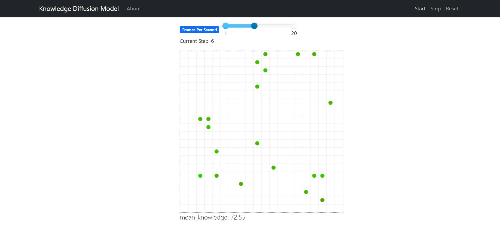

# Mesa Tutorial

## MultiGrid

MultiGrid is used to calculate agent positions, neighbors and other useful methods. 
Source [here](https://mesa.readthedocs.io/en/latest/apis/space.html#mesa.space.MultiGrid.move_agent).

## Visualization

### Agents Portrayal

The KdModel_Viz.py uses a *agent_portrayal* method to represent an agent on the UI. This method takes an agent as an argument and returns a dict with the following keys describing how the agent will be drawn. 
Source page [here](https://mesa.readthedocs.io/en/main/modular-visualization.html).

- "Shape": Can be "circle", "rect" or "arrowHead"
    - For Circles:
        - "r": The radius, defined as a fraction of cell size. r=1 will fill the entire cell.
    - For rectangles:
        - "w", "h": The width and height of the rectangle, which are in fractions of cell width and height.
    - For arrowHead:
        - "scale": Proportion scaling as a fraction of cell size.
        - "heading_x": represents x direction unit vector.
        - "heading_y": represents y direction unit vector.
- "Color": The color to draw the shape in; needs to be a valid HTML color, e.g."Red" or "#AA08F8"
- "Filled": either "true" or "false", and determines whether the shape is filled or not.
- "Layer": Layer number of 0 or above; higher-numbered layers are drawn above lower-numbered layers.
- "text": Text to overlay on top of the shape. Normally, agent's unique_id is used .
- "text_color": Color of the text overlay.

(Shapes also have "x" and "y" coordinates, for the x and y of the grid cell in which it is, but CanvasGrid adds those automatically).

### Model params

UserParams (*from mesa.visualization.UserParam* package) are used to change paramaters values while the simulation is running and come by 6 types :
- NUMBER = "number"
    - name=""
    - value=None
    - description=None
- CHECKBOX = "checkbox"
    - name=""
    - value=None
    - description=None
- CHOICE = "choice"
    - name=""
    - value=None
    - choices=None
    - description=None
- SLIDER = "slider"
    - name="",
    - value=None,
    - min_value=None,
    - max_value=None,
    - step=1,
    - description=None,
-  STATIC_TEXT = "static_text"
    - value=None

[More info](https://github.com/projectmesa/mesa-viz-tornado/blob/main/mesa_viz_tornado/UserParam.py)

## Resources
- Youtube [tutorial](https://www.youtube.com/watch?v=fUrUWnWGHEQ&list=PLF0b3ThojznRpQOd7iFukqXybbMV_vwZn&index=1) followed for this project
- Super [documentation](https://mesa.readthedocs.io/en/latest/apis/time.html) for Mesa library
- Visualization [CanvasGrid](https://mesa.readthedocs.io/en/main/tutorials/adv_tutorial_legacy.html)
